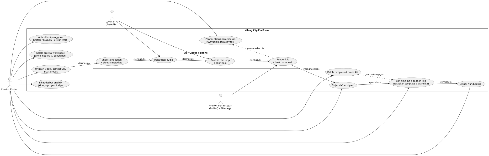

<div align="center">
  
  <h1>Vibing Clip</h1>
  <p>AI-first clip studio for turning long videos into scroll-stopping shorts.</p>
  <p>
    <a href="#features">Features</a> ·
    <a href="#ui-showcase">UI Showcase</a> ·
    <a href="#motion">Motion</a> ·
    <a href="#architecture">Architecture</a> ·
    <a href="#quickstart">Quickstart</a>
  </p>
  
  <p>
    
    
   
  </p>
</div>

<p align="center">
  
  
  
  
  
  
  
  
</p>

---

##  About
Vibing Clip adalah platform full-stack untuk ngubah video panjang jadi shorts yang siap publish. Stack ini gabungin UI modern, pipeline AI, dan processing video biar workflow terasa cepat dan rapi.

##  Features
-  AI transcription + clip suggestion, langsung dari audio nyata.
-  Clip editor dengan timeline, caption styling, safe area, dan preset tema.
-  Analytics dashboard untuk performa clips dan proyek.
-  Template, branding kit, dan export settings biar output konsisten.
-  Upload multi-source (file/link), queue processing, dan status real-time.
-  JWT auth, refresh token, dan guard untuk flow aman.


##  Architecture
<p>
  
</p>
<p>
  
</p>

##  Tech Stack
- Frontend: Vite + React + TypeScript + Tailwind
- Backend: NestJS, TypeORM (SQLite dev), Redis + BullMQ, JWT auth, FFmpeg integration
- AI Service: FastAPI (transcription + clip suggestions)

##  Quickstart
**Startup order:** Redis -> AI service -> Backend -> Frontend

<details>
  <summary><strong>AI Service (vibingclip-ai)</strong></summary>

```bash
cd vibingclip-ai
cp .env.example .env
python3.12 -m venv .venv && source .venv/bin/activate
pip install -r requirements.txt
uvicorn app.main:app --reload --port 5001
```
</details>

<details>
  <summary><strong>Backend (vibingclip-be)</strong></summary>

```bash
cd vibingclip-be
cp .env.example .env
npm install
npm run start:dev
```

Notes:
- Ensure Redis is running (`localhost:6379`).
- Ensure FFmpeg is on PATH (or set `FFMPEG_PATH`).
- Set `AI_SERVICE_BASE_URL=http://localhost:5001`.
</details>

<details>
  <summary><strong>Frontend (vibingclip-fe)</strong></summary>

```bash
cd vibingclip-fe
npm install
cp .env.example .env
npm run dev
```

Notes:
- Fill Firebase keys and `VITE_API_URL` in `.env`.
- Default Vite port: `5173`.
</details>

##  API Flow (backend)
1. Register/login to get access/refresh tokens.
2. Upload video via `POST /uploads/video` (multipart `video`). A Project is created and `project.ingest` job enqueued.
3. Check `/projects` and `/projects/:id/status` for progress.
4. Clips generated after AI analysis are available via `/projects/:id/clips` or `/clips/:id`.

**Quick AI test:**
```bash
curl -X POST http://localhost:5001/api/v1/transcribe \
  -H "Content-Type: application/json" \
  -d '{"filePath":"/tmp/audio.wav"}'
```

##  External Dependencies
- Redis at `REDIS_HOST:REDIS_PORT` for BullMQ queues.
- FFmpeg installed and accessible (set `FFMPEG_PATH` if not on PATH).
- Python AI service at `AI_SERVICE_BASE_URL` implementing:
  - `POST /api/v1/transcribe` { filePath }
  - `POST /api/v1/analyze/transcript` { transcript, durationSeconds, language?, maxClips? }

##  Project Layout
```
.
├── vibingclip-fe        # Vite + React frontend
├── vibingclip-be        # NestJS backend
├── vibingclip-ai        # FastAPI AI service
├── activity.svg         # Activity flow diagram
├── usecase.svg          # Use case diagram
└── docs/readme          # README visuals (logo, UI, animations)
```

##  Notes
- Entities: User, Project, Clip, ProcessingJob, Template, BrandProfile, ActivityLog.
- Queue: `video-processing` with processors for ingest, metadata, transcription, analysis, and clip rendering.
- Response shape is wrapped: `{ data: ... }` with consistent interceptors and filters.
- Backend ingest downloads links with yt-dlp, extracts audio with ffmpeg, and sends real audio to the AI service.
- Frontend includes auth pages, analytics, clip editor, templates, and branding UI.
