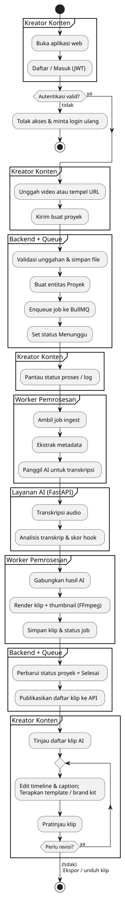

<div align="center">
  
  <h1>Vibing Clip Backend</h1>
  <p>NestJS service for auth, projects, processing, and clip delivery.</p>
  <p>
    <a href="#responsibilities">Responsibilities</a> ·
    <a href="#api-flow">API Flow</a> ·
    <a href="#quickstart">Quickstart</a> ·
    <a href="#configuration">Configuration</a> ·
    <a href="#dependencies">Dependencies</a>
  </p>
  
  <p>
    
    
    
  </p>
</div>

<p align="center">
  
  
  
  
  
  
</p>

---

##  About
Vibing Clip Backend orchestrates authentication, uploads, processing, and clip delivery. It manages queues, calls the AI service for transcription + analysis, and serves the REST API for the frontend.

##  Responsibilities
-  Auth flows with access + refresh tokens.
-  Upload and ingest videos (file or link).
-  Background jobs for ingest, transcription, analysis, and render.
-  Clip metadata, templates, and brand profiles.
-  Consistent response wrapping and error handling.

##  Processing Pipeline
-  Queue: `video-processing`.
-  Stages: ingest -> metadata -> transcription -> analysis -> clip rendering.
-  Link ingestion uses yt-dlp, audio extraction uses ffmpeg.

<p>
  
</p>

##  API Flow
1. Register/login to get access/refresh tokens.
2. Upload video via `POST /uploads/video` (multipart `video`). A Project is created and `project.ingest` job enqueued.
3. Check `/projects` and `/projects/:id/status` for progress.
4. Clips generated after AI analysis are available via `/projects/:id/clips` or `/clips/:id`.

##  Quickstart
<details>
  <summary><strong>Install & run</strong></summary>

```bash
npm install
cp .env.example .env
npm run start:dev
```
</details>

##  Configuration
| Variable | Default | Notes |
| --- | --- | --- |
| `PORT` | `4000` | API port.
| `NODE_ENV` | `development` | Environment.
| `DATABASE_URL` | `file:./vibingclip.db` | SQLite dev storage.
| `REDIS_HOST` | `localhost` | Redis host.
| `REDIS_PORT` | `6379` | Redis port.
| `AI_SERVICE_BASE_URL` | `http://localhost:5001` | AI service base URL.
| `JWT_SECRET` | `supersecret` | Replace for production.
| `ACCESS_TOKEN_EXPIRES_IN` | `15m` | Access token TTL.
| `REFRESH_TOKEN_EXPIRES_IN` | `7d` | Refresh token TTL.
| `FFMPEG_PATH` | `ffmpeg` | Path to ffmpeg binary.
| `YT_DLP_PATH` | `yt-dlp` | Path to yt-dlp binary.
| `DOWNLOAD_DIR` | `downloads` | Video download directory.
| `RENDERS_DIR` | `renders` | Render output directory.
| `AUDIO_CACHE_DIR` | `audio-cache` | Audio cache directory.

##  Dependencies
-  Redis for BullMQ queues.
-  FFmpeg for audio extraction and rendering.
-  yt-dlp for link ingestion.
-  AI service running at `AI_SERVICE_BASE_URL`.

##  Notes
-  Rendering writes to `RENDERS_DIR`; failures mark jobs as failed.
-  Response shape is wrapped as `{ data: ... }` by interceptors.
-  Designed to pair with the `vibingclip-fe` frontend.
